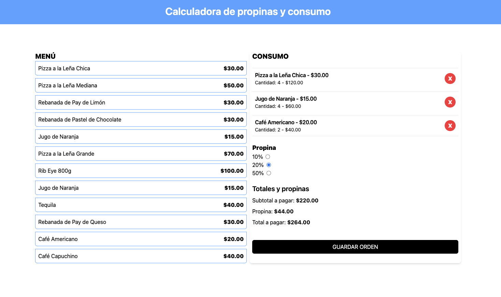

# Calculadora de propinas

## Notas importantes de este pequeño y simple proyecto.

[] La data de muestra se encuentra en la carpeta data.
[] Las funciones se encuentran en hooks/useOrder.ts.
[] En TipForm se utilizo el signo + para convertir el valor a número como lo pide TS.
[] En TipForm para limpiar el valor seleccionado se utiliza checked comparando el valor seleccionado contra el valor almacenado de la propina, al ser diferentes limpia el input de tipo option.

URL producción: https://eda-tip-calculator.netlify.app/

